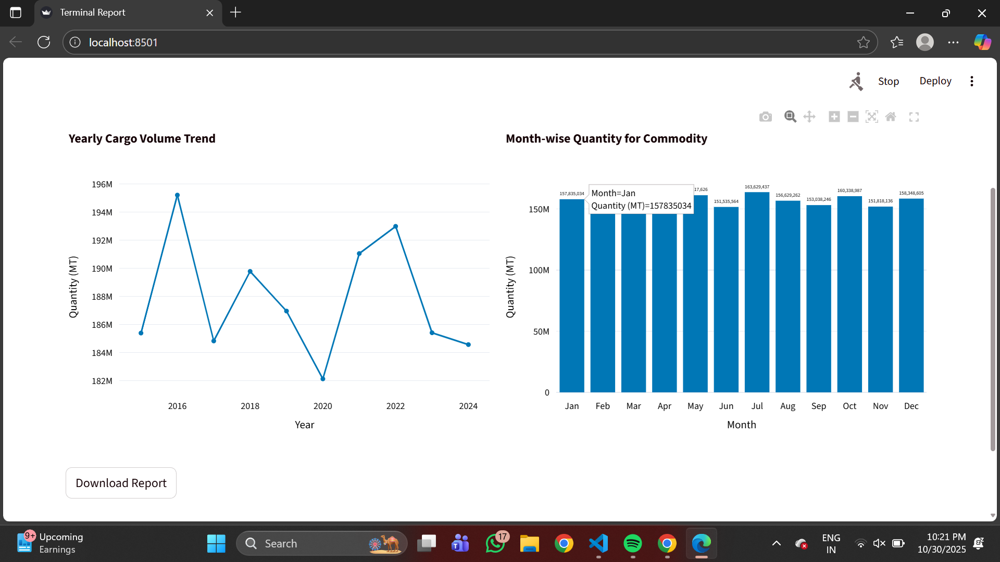
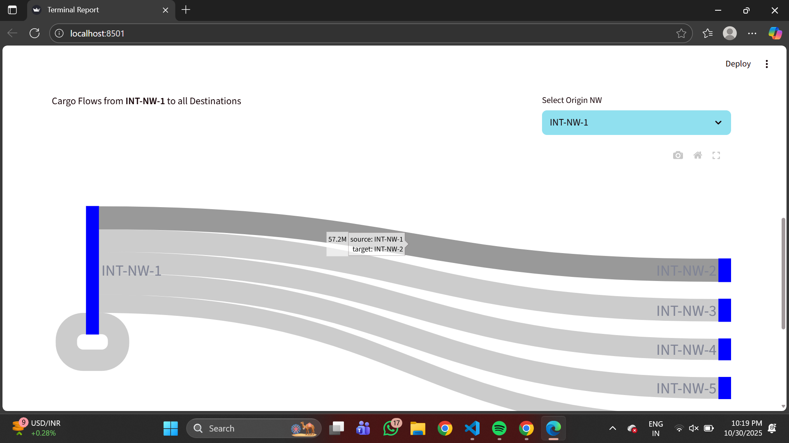
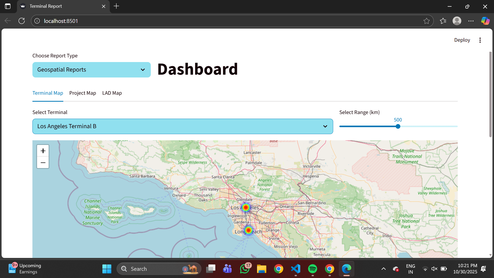
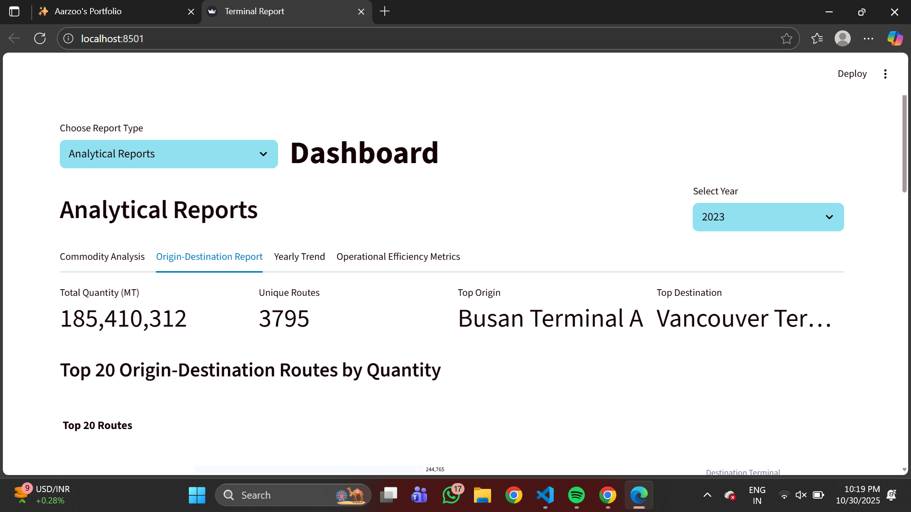

### terminal_visualization
Terminal Analytics Dashboard is an interactive Streamlit web app designed to visualize terminal data, including monthly trends, yearly performance, commodity analysis, and geospatial mapping of terminals.
This project demonstrates how analytical and geographical data can be visualized in a single interface using Python and Streamlit.

Note: The dataset used is dummy data generated by GPT for demonstration purposes.

### 🧠 Features

📈 Monthly Trend Analysis – visualize performance over months
📅 Yearly Trend Comparison – track year-over-year changes
⚙️ Commodity Report – analyze quantity and share by commodity
🌍 Geospatial Visualization – view terminals on an interactive map
🧾 Analytical Insights – view summarized KPIs and charts

### 🛠️ Tech Stack

Python
Streamlit
Pandas
Plotly , Matplotlib
Folium (for maps)

### 📸 Sample Visuals

